# RAMSES-SEFA System Architecture

This document describes the complete architecture of the RAMSES-SEFA system, including both the managed and managing systems.

## System Overview

```mermaid
flowchart TD
    %% Managing System
    subgraph ManagingSystem[RAMSES Managing System]
        Dashboard[Dashboard]
        Monitor[Monitor]
        Knowledge[Knowledge]
        Analyse[Analyse]
        Plan[Plan]
        Execute[Execute]
    end
    
    %% Simple Managed System
    subgraph SimpleManagedSystem[Simple Managed System]
        direction TB
        SMSEureka[Eureka Service]
        SMSConfigServer[Config Server]
        SMSMySQL[(MySQL Database)]
        
        %% API Layer
        SMSAPIGateway[API Gateway]
        RestClient[Rest Client]
        
        %% Core Services
        RandIntProducer[RandInt Producer]
        RandIntVendor[RandInt Vendor]
        
        %% Monitoring Components
        SMSProbe[Probe]
        SMSActuator[Actuator]
        
        %% SMS Internal Connections
        SMSAPIGateway --> SMSEureka
        RandIntProducer --> SMSEureka
        RandIntVendor --> SMSEureka
        SMSProbe --> SMSEureka
        SMSActuator --> SMSEureka
        
        SMSAPIGateway --> SMSConfigServer
        RandIntProducer --> SMSConfigServer
        RandIntVendor --> SMSConfigServer
        SMSProbe --> SMSConfigServer
        SMSActuator --> SMSConfigServer
        
        %% Service Connections
        RestClient --> SMSAPIGateway
        SMSAPIGateway --> RandIntProducer
        SMSAPIGateway --> RandIntVendor
        
        %% Database Connections
        RandIntProducer --> SMSMySQL
        RandIntVendor --> SMSMySQL
        
        %% Monitoring Connections
        SMSProbe --> RandIntProducer
        SMSProbe --> RandIntVendor
        SMSActuator --> RandIntProducer
        SMSActuator --> RandIntVendor
    end
    
    %% Managed System
    subgraph ManagedSystem[SEFA Managed System]
        direction TB
        Eureka[Eureka Service]
        ConfigServer[Config Server]
        MySQL[(MySQL Database)]
        
        %% API Layer
        SEFAAPIGateway[SEFA API Gateway]
        
        %% Core Services
        WebService[Web Service]
        RestaurantService[Restaurant Service]
        OrderingService[Ordering Service]
        PaymentProxy1[Payment Proxy 1]
        PaymentProxy2[Payment Proxy 2]
        PaymentProxy3[Payment Proxy 3]
        DeliveryProxy1[Delivery Proxy 1]
        DeliveryProxy2[Delivery Proxy 2]
        DeliveryProxy3[Delivery Proxy 3]
        
        %% Monitoring Components
        Probe[Probe]
        Actuator[Actuator]
        
        %% SEFA Internal Connections
        SEFAAPIGateway --> Eureka
        WebService --> Eureka
        RestaurantService --> Eureka
        OrderingService --> Eureka
        PaymentProxy1 --> Eureka
        PaymentProxy2 --> Eureka
        PaymentProxy3 --> Eureka
        DeliveryProxy1 --> Eureka
        DeliveryProxy2 --> Eureka
        DeliveryProxy3 --> Eureka
        Probe --> Eureka
        Actuator --> Eureka
        
        SEFAAPIGateway --> ConfigServer
        WebService --> ConfigServer
        RestaurantService --> ConfigServer
        OrderingService --> ConfigServer
        PaymentProxy1 --> ConfigServer
        PaymentProxy2 --> ConfigServer
        PaymentProxy3 --> ConfigServer
        DeliveryProxy1 --> ConfigServer
        DeliveryProxy2 --> ConfigServer
        DeliveryProxy3 --> ConfigServer
        Probe --> ConfigServer
        Actuator --> ConfigServer
        
        %% Service Connections
        SEFAAPIGateway --> WebService
        WebService --> RestaurantService
        WebService --> OrderingService
        OrderingService --> PaymentProxy1
        OrderingService --> PaymentProxy2
        OrderingService --> PaymentProxy3
        OrderingService --> DeliveryProxy1
        OrderingService --> DeliveryProxy2
        OrderingService --> DeliveryProxy3
        
        %% Database Connections
        RestaurantService --> MySQL
        OrderingService --> MySQL
        
        %% Monitoring Connections
        Probe --> WebService
        Probe --> RestaurantService
        Probe --> OrderingService
        Probe --> PaymentProxy1
        Probe --> PaymentProxy2
        Probe --> PaymentProxy3
        Probe --> DeliveryProxy1
        Probe --> DeliveryProxy2
        Probe --> DeliveryProxy3
        
        Actuator --> WebService
        Actuator --> RestaurantService
        Actuator --> OrderingService
        Actuator --> PaymentProxy1
        Actuator --> PaymentProxy2
        Actuator --> PaymentProxy3
        Actuator --> DeliveryProxy1
        Actuator --> DeliveryProxy2
        Actuator --> DeliveryProxy3
    end
    
    %% Cross-System Connections
    Dashboard --> Monitor
    Monitor --> Knowledge
    Knowledge --> Analyse
    Analyse --> Plan
    Plan --> Execute
    Execute --> Monitor
    
    Monitor --> SimpleManagedSystem
    Monitor --> ManagedSystem
    Execute --> SimpleManagedSystem
    Execute --> ManagedSystem
    
    %% Styling
    classDef managing fill:#bbf,stroke:#333,stroke-width:2px
    classDef simple fill:#f9f,stroke:#333,stroke-width:2px
    classDef managed fill:#bfb,stroke:#333,stroke-width:2px
    classDef registry fill:#fbb,stroke:#333,stroke-width:2px
    classDef database fill:#ffd,stroke:#333,stroke-width:2px
    classDef monitoring fill:#fdf,stroke:#333,stroke-width:2px
    
    class Dashboard,Monitor,Knowledge,Analyse,Plan,Execute managing
    class SMSAPIGateway,RestClient,RandIntProducer,RandIntVendor simple
    class WebService,RestaurantService,OrderingService,PaymentProxy1,PaymentProxy2,PaymentProxy3,DeliveryProxy1,DeliveryProxy2,DeliveryProxy3,SEFAAPIGateway managed
    class SMSEureka,SMSConfigServer,Eureka,ConfigServer registry
    class SMSMySQL,MySQL database
    class SMSProbe,SMSActuator,Probe,Actuator monitoring
```

## System Components

### RAMSES Managing System
- **Dashboard**: User interface for system monitoring and control
- **Monitor**: Collects metrics and performance data
- **Knowledge**: Stores system state and knowledge
- **Analyse**: Analyzes system behavior
- **Plan**: Generates adaptation strategies
- **Execute**: Implements system changes

### Simple Managed System
- **Eureka Service**: Service registry and discovery
- **Config Server**: Centralized configuration management
- **MySQL Database**: Persistent data storage
- **API Gateway**: Entry point for external requests
- **Rest Client**: Client application for making requests
- **RandInt Producer**: Generates random integers
- **RandInt Vendor**: Provides random integer services
- **Probe**: Service health monitoring
- **Actuator**: Service management and metrics

### SEFA Managed System
- **Eureka Service**: Service registry and discovery
- **Config Server**: Centralized configuration management
- **MySQL Database**: Persistent data storage
- **SEFA API Gateway**: Main entry point for SEFA services
- **Web Service**: Main web application
- **Restaurant Service**: Restaurant management
- **Ordering Service**: Order processing
- **Payment Proxies**: Payment processing (3 instances)
- **Delivery Proxies**: Delivery management (3 instances)
- **Probe**: Service health monitoring
- **Actuator**: Service management and metrics

## Communication Patterns

1. **Service Discovery and Configuration**
   - All services register with Eureka
   - Services fetch configuration from Config Server
   - Dynamic service discovery enables load balancing

2. **API Gateway Routing**
   - API Gateways route external requests
   - Handle authentication and authorization
   - Provide load balancing and circuit breaking

3. **Service-to-Service Communication**
   - Direct communication between services
   - Coordinated through API Gateways
   - Multiple instances for load balancing

4. **Data Persistence**
   - Services store data in MySQL
   - Database connections managed through connection pooling
   - Transaction management ensures data consistency

5. **Monitoring and Management**
   - Probes monitor service health and metrics
   - Actuators provide management endpoints
   - Integration with service discovery

6. **Adaptation Flow**
   - Monitor detects issues
   - Knowledge stores system state
   - Analyse identifies problems
   - Plan generates solutions
   - Execute implements changes

## Deployment

The system can be deployed using:
- Docker Compose for containerized deployment
- Individual service deployment scripts
- Combined setup scripts for full system deployment

## System Integration

1. **Service Discovery Integration**
   - Eureka enables dynamic service discovery
   - Services can be scaled horizontally
   - Load balancing across multiple instances

2. **Configuration Integration**
   - Centralized configuration management
   - Dynamic configuration updates
   - Environment-specific settings

3. **API Gateway Integration**
   - Unified entry points for all services
   - Consistent security and routing
   - Load balancing and failover

4. **Database Integration**
   - Centralized data storage
   - Transaction management
   - Data consistency across services

5. **Monitoring Integration**
   - Probes and Actuators provide comprehensive monitoring
   - Integration with service discovery
   - Real-time health checks

6. **Adaptation Integration**
   - Managing system can adapt both managed systems
   - Changes are coordinated across systems
   - Maintains system stability during adaptations

7. **Knowledge Integration**
   - Centralized knowledge store
   - Shared across managing components
   - Used for decision making and adaptation 